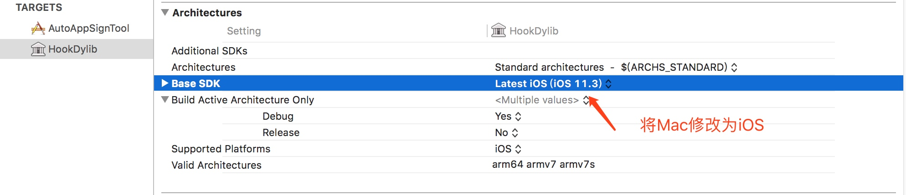

# iOSInjectDylib
iOS App可执行文件中注入Dylib库

## dylib 注入

### 1. 新建`TARGETS`


### 2. 添加依赖关系

- 在`Buildd Phases`选择`New Copy Files Phase`新建依赖库文件，选择`Destination`为`Framework`。添加刚刚新建的frammework库


### 3. 修改平台

- 修改`Architectures`为`iOS`


- 修改`Signing`为`iOS`


### 4. 修改MachO文件的Load Commands（将`Dylib`库注入到可执行文件中）

- 使用`yololib`工具注入（手动）

```
$ yololib WeChact Frameworks/libHookDylib.dylib
```


- 使用`yololib`工具注入（脚本）

```
# 需要注入的动态库的路径(写死了)
INJECT_FRAMEWORK_RELATIVE_PATH="Frameworks/libHookDylib.dylib"

## 通过工具实现注入
"/${SRCROOT}"/yololib "$TARGET_APP_PATH/$APP_BINARY" "$INJECT_FRAMEWORK_RELATIVE_PATH"
```


### 4. 注入代码
实现`load`方法，利用`Method Swizzle`实现修改


